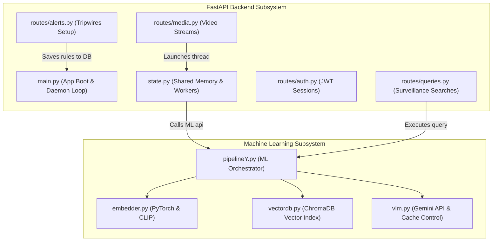

# WatchTower.ai Backend & ML Architecture Guide

This document provides a logical, easy-to-understand breakdown of the entire WatchTower.ai backend server and Machine Learning (ML) system. It explains the exact responsibility of each module, how they coordinate, and how data flows through the application.

---

## 1. System Topology Overview

The application is split into two major subsystems:
1.  **FastAPI Backend Subsystem (`backend/`)**: Handles HTTP requests, manages cookie-based user authentication sessions, coordinates background threading workers, and runs the real-time threat detection daemon.
2.  **Machine Learning Subsystem (`model/`)**: Selects hardware acceleration device, converts frames to normalized embeddings (CLIP), performs vector similarity searches (ChromaDB), and triggers visual validation audits (Gemini API).



---

## 2. Machine Learning Subsystem (`model/`)

Instead of keeping all machine learning logic in a single file, the ML engine is split into four decoupled components. The main file [pipelineY.py](file:///Users/satyam/.gemini/antigravity/scratch/WatchTower.ai/model/pipelineY.py) acts as a thin orchestrator that routes data to the other three modules.

### [embedder.py](file:///Users/satyam/.gemini/antigravity/scratch/WatchTower.ai/model/embedder.py) — Hardware-Accelerated Embeddings
*   **Role**: Handles all PyTorch tensor manipulation and CLIP model inference.
*   **Logical Responsibility**:
    *   **Device Discovery**: Auto-detects if it should run on NVIDIA GPU (`cuda`), Apple Silicon (`mps`), or fall back to CPU.
    *   **Preprocessing**: Converts BGR raw OpenCV images to normalized RGB floating-point PyTorch tensors matching CLIP's original training parameters.
    *   **Encoding**: Runs the Zero-Shot CLIP visual and text transformer encoders (`ViT-B-32`) to return 512-dimension vector representations.
    *   **Multimodal Vector Fusion**: Mathematically blends image vectors and text vectors using a weighted average and L2 normalizes the result so it is compatible with cosine distance.

### [vectordb.py](file:///Users/satyam/.gemini/antigravity/scratch/WatchTower.ai/model/vectordb.py) — Vector Storage & Retrieval
*   **Role**: Communicates directly with the persistent local vector database, ChromaDB.
*   **Logical Responsibility**:
    *   **Collection Setup**: Manages indices (tables) configured for **cosine space** queries.
    *   **Storage**: Inserts batches of extracted frame vectors alongside metadata dictionaries (like source name, timestamp, and local frame filepath).
    *   **Clean Purge**: Clears out previous vector recordings when an operator re-uploads a video under the same name.
    *   **Timeline Trajectory Builder**: Gathers closest match frames across all camera vaults, filters by maximum distance, and groups close matches within 60 seconds into continuous timeline blocks.

### [vlm.py](file:///Users/satyam/.gemini/antigravity/scratch/WatchTower.ai/model/vlm.py) — Vision-Language Validation & Optimization
*   **Role**: Acts as the intelligent supervisor, using the Gemini API to double-check search matches and write reports.
*   **Logical Responsibility**:
    *   **Image Downscaling**: Resizes heavy high-resolution CCTV frames to a max side of 512px to dramatically reduce Gemini token consumption.
    *   **MD5-Hashed Caching**: Performs MD5 checks on prompt requests; if a prompt has been processed before, returns the cached text to save API quota.
    *   **Visual Logic Reasoning**: Answers natural language query questions (e.g. comparing a suspect mugshot visual with CCTV frames to declare `MATCH CONFIRMED` or `NO MATCH`).

### [pipelineY.py](file:///Users/satyam/.gemini/antigravity/scratch/WatchTower.ai/model/pipelineY.py) — High-Level Coordinator
*   **Role**: Coordinates the three modules above and exposes a backward-compatible public interface to the backend.
*   **Logical Responsibility**:
    *   Exposes `ingest_video()`, `query()`, `track_timeline()`, and `find_suspect_by_image()`.

---

## 3. Backend Subsystem (`backend/`)

The backend is built using FastAPI. It is split into routers to keep routes grouped logically, and uses a shared state file to manage threading buffers.

### [state.py](file:///Users/satyam/.gemini/antigravity/scratch/WatchTower.ai/backend/state.py) — Shared Memory, Threads, and Utilities
*   **Role**: Houses all shared variables in RAM and runs long-running background task threads.
*   **Logical Responsibility**:
    *   **RAM Buffers**: Stores current frames (`latest_frames`), video aspect-ratios (`stream_orientations`), and ingestion states (`video_processing_status`).
    *   **Alert Integrations**: Dispatches photos and reports to Telegram, and triggers offline voice warnings (`pyttsx3`) on a detached thread.
    *   **Ingestion Worker**: Runs `process_video_task` on separate OS threads. Decodes frames, calls the ML Engine to save vectors, and pushes frame bytes back to the main loop to update the stream player.

### [routes/auth.py](file:///Users/satyam/.gemini/antigravity/scratch/WatchTower.ai/backend/routes/auth.py) — Authentication & Sessions Router
*   **Role**: Boilerplate JWT user session manager.
*   **Logical Responsibility**:
    *   Validates user registration, password hashing (using Argon2), and logins.
    *   **JWT Sentry Dependency**: Exports `get_current_user`, which validates JWT cookies or Authorization headers to authenticate secure routes.

### [routes/media.py](file:///Users/satyam/.gemini/antigravity/scratch/WatchTower.ai/backend/routes/media.py) — Streams & Uploads Router
*   **Role**: Manages incoming video streams and file uploads.
*   **Logical Responsibility**:
    *   Receives file uploads, writing them to disk in chunks to save RAM.
    *   Registers up to 3 camera livestream configurations.
    *   **MJPEG Streamer**: Exposes a streaming endpoint `/api/media/stream/{source_id}` that yields multipart boundary frames, which can be linked in standard HTML `` tags.

### [routes/queries.py](file:///Users/satyam/.gemini/antigravity/scratch/WatchTower.ai/backend/routes/queries.py) — Search Operators Router
*   **Role**: Handles all operator search queries.
*   **Logical Responsibility**:
    *   **ArmorIQ Safety Check**: Passes operator search text to `armoriq_supervisor` to block demographic profiling or unauthorized surveillance in private rooms (like restrooms).
    *   Calls the ML Engine for manual searching, cross-camera timeline tracing, and suspect facial mugshot identification.

### [routes/alerts.py](file:///Users/satyam/.gemini/antigravity/scratch/WatchTower.ai/backend/routes/alerts.py) — Tripwires & WebSocket Router
*   **Role**: Manages custom security tripwire rules and auditing database logs.
*   **Logical Responsibility**:
    *   Saves active alert tripwire rules (e.g. "Alert if someone is climbing a fence").
    *   **Websocket Hub**: Hosts `/ws/alerts`, which maintains active connections to frontend clients to push instant security alerts.

### [main.py](file:///Users/satyam/.gemini/antigravity/scratch/WatchTower.ai/backend/main.py) — Orchestrator & Live Monitoring Daemon
*   **Role**: Initializes FastAPI, CORS, routes routers, and runs the live overwatch daemon.
*   **Logical Responsibility**:
    *   **Startup Event Handler**: Spawns the async `background_alert_daemon` in the main loop.
    *   **Live Overwatch Daemon**: Periodically loops through active tripwire rules, searches live streams, writes matching threats to SQLite database log tables, broadcasts alerts to active websockets, and triggers Telegram and Voice warnings.

---

## 4. Key Dynamic System Flows

### Flow A: Ingesting Video & Live Web Streaming
```
[Video Feed / File] ──> [Media Route] ──> [Launches Worker Thread in state.py]
                                                   │
     ┌─────────────────────────────────────────────┴─────────────────────────────────────────────┐
     ▼                                                                                           ▼
[Decodes BGR Frames via cv2]                                                           [Preprocesses on GPU/MPS]
     │                                                                                           │
     ▼                                                                                           ▼
[Writes JPG Bytes to state.latest_frames]                                              [CLIP Batch Image Encode]
     │                                                                                           │
     ▼                                                                                           ▼
[asyncio.Event wakes up WebSocket/Stream Route]                                        [Save Vectors to ChromaDB]
     │
     ▼
[Streams multipart MJPEG bytes to frontend browser]
```

### Flow B: Live Threat Alert Daemon Execution
```
[startup] ──> [FastAPI App Registers startup_event] ──> [Runs background_alert_daemon loop every 10s]
                                                                      │
     ┌────────────────────────────────────────────────────────────────┴────────────────────────────────┐
     ▼                                                                                                 ▼
[Fetches Tripwire Rules from DB]                                                     [Queries ML Engine on Live Stream]
     │                                                                                                 │
     ▼                                                                                                 ▼
[If Target found ("yes" in VLM reply)] ──> [Write Incident Trigger Log to SQLite DB] ──> [notifier.broadcast() Alert Event]
                                                                                                       │
     ┌─────────────────────────────────────────────────────────────────────────────────────────────────┴──┐
     ▼                                                                                                    ▼
[Telegram API dispatches Text + Image Capture]                                                     [TTS pyttsx3 voice alert]
```
